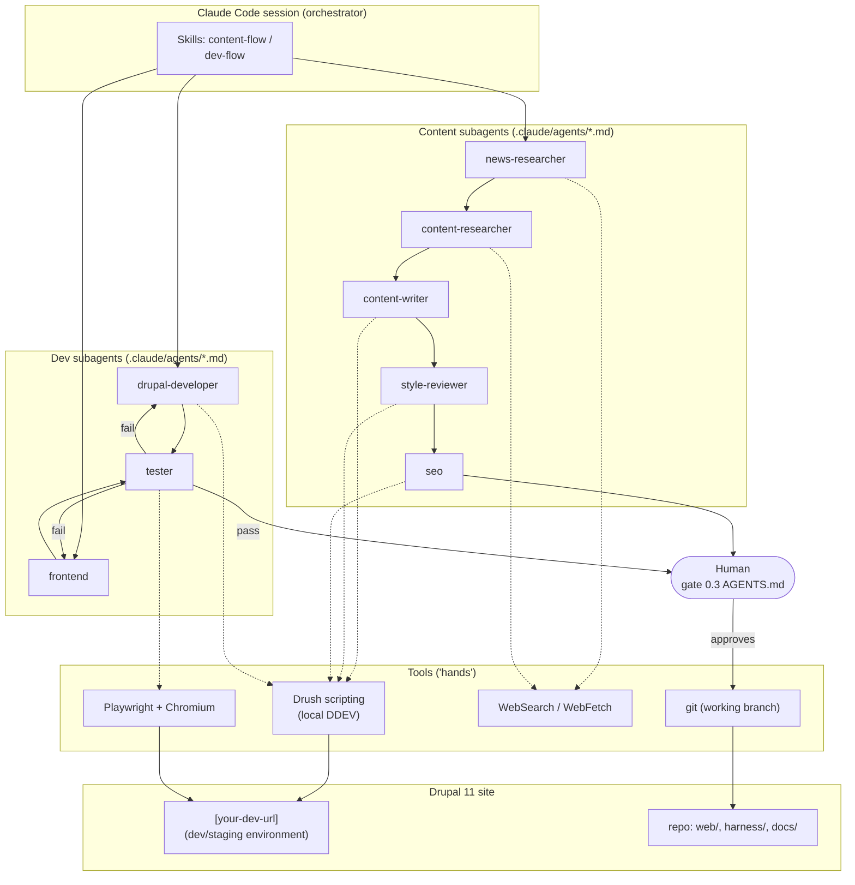
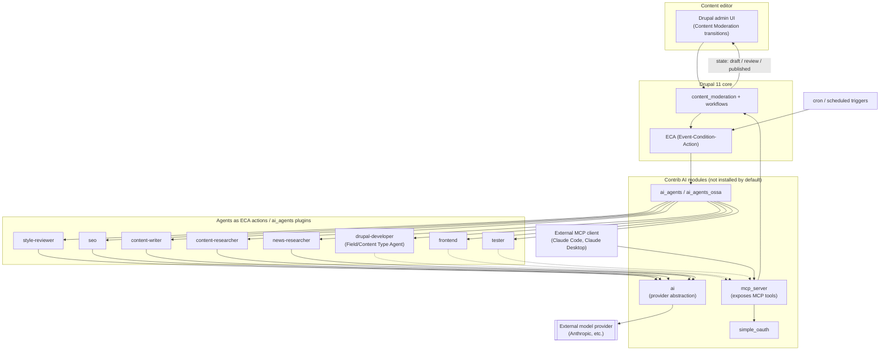
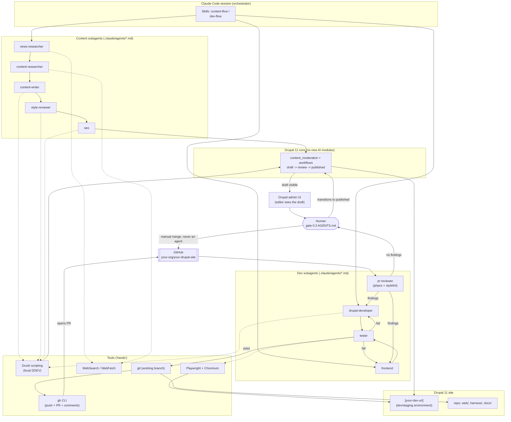
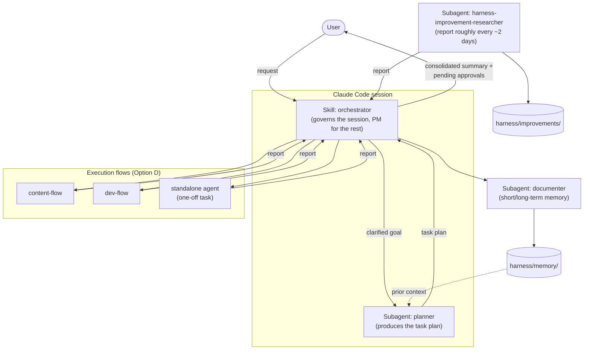

# Architecture maps: Option A, B, and D

Component diagrams for the options evaluated in [implementation-options.md](implementation-options.md). Mermaid format (renders on GitHub and in most Markdown viewers). Option C (an external harness in the style of an MCP-based agent runtime) doesn't get its own map because it's essentially Option A with the "hands" replaced by `mcp_server` instead of direct Drush — the same diagram as Option A, swapping the `HANDS` block for the `AI_STACK`/`MCP` block from Option B.

## Option A — Claude Code subagents (manual orchestration)

**How to read it**: everything lives inside a Claude Code session. The orchestrator (a skill) invokes each subagent in the order of the corresponding flow. The "hands" (Drush, Playwright, WebSearch) are ordinary tools any Drupal project already uses — nothing new to install in Drupal. The human-in-the-loop appears at two points: approving content before publishing, and approving code before commit (solid lines = main flow; dashed lines = tool use).

> This diagram is the original Option A proposal. In a fuller implementation (Option D, below) the dev side no longer ends at "approve code before commit" but at a Pull Request reviewed by `pr-reviewer` — see the Option D diagram for the updated flow.

---

## Option B — Native in Drupal (contrib AI modules)

**How to read it**: here the agents live **inside** Drupal as ECA actions / `ai_agents` plugins, triggered by `content_moderation` transitions or by cron — not by an open Claude Code session. The `ai` module is the layer that calls the external model provider (Anthropic or another). `mcp_server` is the entry point for an external MCP client (including a Claude Code session, if you wanted to combine this with Option A) to also operate on the site. The human approval gate is native `content_moderation` itself: an editor transitions content from draft to published from the Drupal UI.

---

## Option D — Hybrid (recommended)

Same as Option A (agents live in the Claude Code session, "hands" are Drush/Playwright/WebSearch), but content is no longer written directly as a published node — it goes through core's `content_moderation`/`workflows` (no need to install `ai`, `ai_agents`, or `mcp_server`), so there's a real draft → review → published state inside Drupal, and an editor can see that draft in the admin UI even though an agent generated it.

**How to read it**: compared to Option A, there are two new blocks. `DRUPAL_CORE` with `content_moderation`/`workflows` (both ship in Drupal core, no `composer require` needed, just enable them) — content agents no longer write a published node directly, they leave the result in draft state, and the human reviews it **from the normal Drupal UI** (not only inside the Claude Code session) and triggers the transition to published. And, on the dev side, the `tester` no longer hands off directly to the human: it first goes through `git`+`gh` (commit, push, PR against `develop` on GitHub) and through `pr-reviewer` (phpcs + stylelint + reasoned review, commenting findings on the PR). Only once the reviewer has no blocking findings does the human see the PR — and they're the only one who merges it, never an agent.

---

## Option D expanded — with orchestrator, planner, documenter, and improvement researcher

An added layer on top of Option D (see [orchestration-flow.md](flows/orchestration-flow.md)). Nothing changes on the Drupal side — it only adds a planning/reporting/memory layer in front of the execution agents.

**How to read it**: the user no longer decides which flow or agent to invoke — they talk to the orchestrator, which delegates planning, dispatches to the existing Option D flows, and consolidates reports with help from the documenter before responding. The improvement researcher runs separately (its own cadence, see its agent document) and its reports get folded into the orchestrator's summary without interrupting the main flow. The orchestrator itself is a skill that governs the session, not a nested subagent — see the technical note in `harness/agents/agent-orchestrator.md`.

---

## Key differences between the three maps

| | Option A | Option B | Option D |
|---|---|---|---|
| Where the agents "think" | Outside Drupal, in the Claude Code session | Inside Drupal, as plugins/ECA actions | Outside Drupal, in the Claude Code session |
| What triggers an agent | The skill orchestrator, invoked by a human (or `/loop`) | `content_moderation` transitions or cron, no external session | Same as A |
| Content state | Direct (Drush writes/publishes) | Native `content_moderation` | Native `content_moderation` (core only) |
| Where the human gate is | In the Claude Code session | In the Drupal admin UI | In both: Claude Code session and Drupal UI (draft visible there) |
| What needs installing | Nothing new in Drupal | `ai`, `ai_agents`/`ai_agents_ossa`, `mcp_server`, `simple_oauth` | Nothing new (just enable core's `content_moderation`/`workflows`) |
| Who can operate the harness | Only someone with a Claude Code session | Any editor with Drupal permissions | Agents: only via Claude Code. Review/publish: any editor |

Option D is, in short, Option A with a single component borrowed from Option B (`DRUPAL_CORE`), without `AI_STACK` or `AGENT_DEFS` — the middle ground recommended in [implementation-options.md](implementation-options.md).
