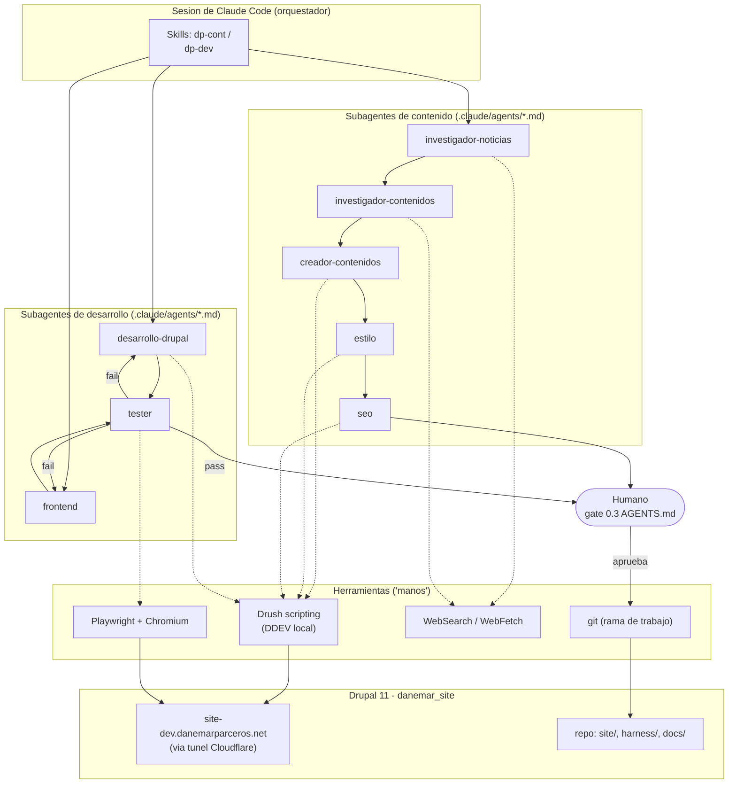
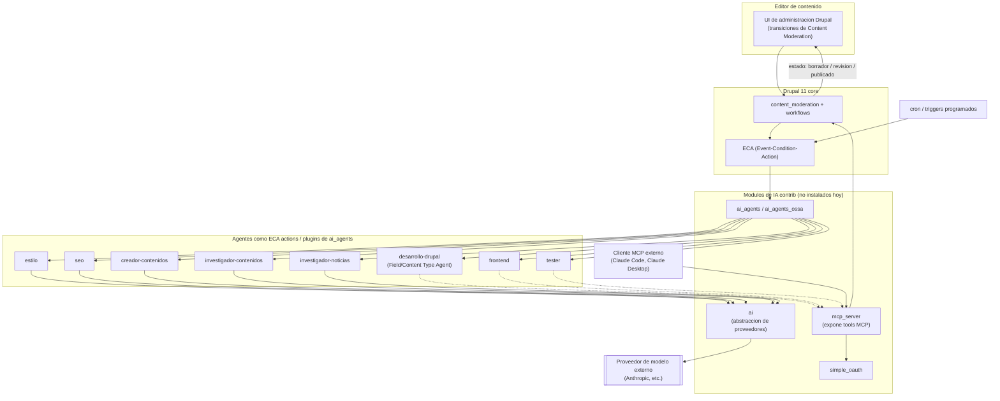
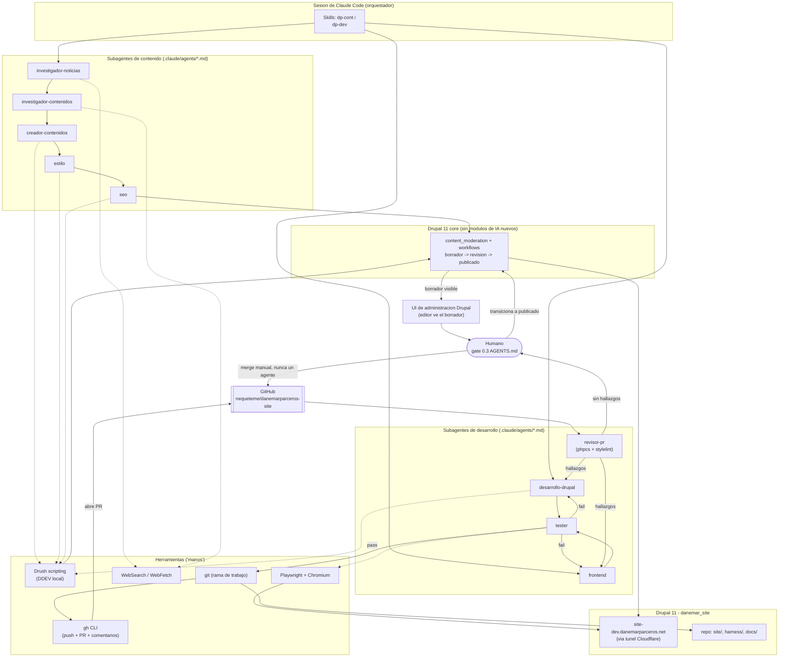
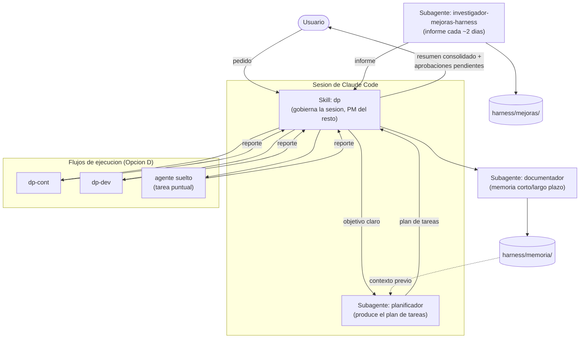

# Mapas de arquitectura: Opción A, B y D

Diagramas de componentes para las opciones evaluadas en
[opciones-implementacion.md](opciones-implementacion.md). Formato Mermaid
(se renderiza en GitHub y en la mayoría de visores Markdown de VSCode). La
Opción C (harness externo tipo `deepseek-harness`) no tiene mapa propio
porque, en esencia, es la Opción A con las "manos" reemplazadas por
`mcp_server` en vez de Drush directo — mismo diagrama de la Opción A,
sustituyendo el bloque `HANDS` por el bloque `AI_STACK`/`MCP` de la Opción B.

## Opción A — Subagentes de Claude Code (orquestación manual)

**Cómo leerlo**: todo vive dentro de una sesión de Claude Code. El
orquestador (una skill) invoca a cada subagente en el orden del flujo
correspondiente. Las "manos" (Drush, Playwright, WebSearch) son las mismas
herramientas ya usadas en los 13 planes del proyecto — nada nuevo que
instalar en Drupal. El único humano-en-el-loop aparece en dos puntos: al
aprobar contenido antes de publicar, y al aprobar código antes de commit
(líneas continuas = flujo principal; líneas punteadas = uso de herramienta).

> Este diagrama es la propuesta original de la Opción A. En la
> implementación real (Opción D, ver más abajo) el lado de desarrollo ya no
> termina en "aprobar código antes de commit" sino en un Pull Request
> revisado por `revisor-pr` — ver el diagrama de la Opción D para el flujo
> actualizado.

---

## Opción B — Nativo en Drupal (módulos de IA contrib)

**Cómo leerlo**: acá los agentes viven **dentro** de Drupal como acciones de
ECA / plugins de `ai_agents`, disparados por transiciones de
`content_moderation` o por cron — no por una sesión de Claude Code abierta.
El módulo `ai` es la capa que llama al proveedor de modelo externo
(Anthropic u otro). `mcp_server` es la puerta de entrada para que un cliente
MCP externo (incluida una sesión de Claude Code, si se quisiera combinar con
la Opción A) también pueda operar sobre el sitio. El gate de aprobación
humano es el mismo `content_moderation` nativo: un editor transiciona el
contenido de borrador a publicado desde la UI de Drupal.

---

## Opción D — Híbrida (recomendada)

Igual que la Opción A (agentes viven en la sesión de Claude Code, "manos" son
Drush/Playwright/WebSearch), pero el contenido ya no se escribe directo como
nodo — pasa por `content_moderation`/`workflows` de **core** (sin instalar
`ai`, `ai_agents` ni `mcp_server`), de modo que existe un estado
borrador → revisión → publicado real dentro de Drupal, y el editor puede ver
ese borrador en la UI de administración aunque quien lo generó fue un agente.

**Cómo leerlo**: respecto a la Opción A hay dos bloques nuevos.
`DRUPAL_CORE` con `content_moderation`/`workflows` (ambos ya vienen en Drupal
core, no requieren `composer require`, solo habilitarlos) — los agentes de
contenido ya no escriben un nodo publicado directamente, dejan el resultado
en estado borrador, y el humano revisa **desde la UI normal de Drupal** (no
solo dentro de la sesión de Claude Code) y dispara la transición a publicado.
Y, del lado de desarrollo (2026-08-18), el `tester` ya no entrega
directamente al humano: primero pasa por `git`+`gh` (commit, push, PR contra
`develop` en GitHub) y por `revisor-pr` (phpcs + stylelint + revisión
razonada, comentando hallazgos en el PR). Solo cuando el revisor no tiene
hallazgos bloqueantes el humano ve el PR — y es el único que lo mergea, nunca
un agente.

---

## Opción D ampliada — con orquestador, planificador, documentador e investigador de mejoras

Capa agregada sobre la Opción D (ver
[flujo-orquestacion.md](flujos/flujo-orquestacion.md)). No cambia nada de
Drupal — solo agrega una capa de planificación/reporte/memoria delante de los
8 agentes de ejecución.

**Cómo leerlo**: el usuario ya no decide qué flujo o agente invocar — habla
con el orquestador, que delega la planificación, dispatcha a los flujos ya
existentes de la Opción D, y consolida los reportes con ayuda del
documentador antes de responder. El investigador de mejoras corre aparte
(cadencia propia, ver su documento de agente) y sus informes se suman al
resumen del orquestador sin interrumpir el flujo principal. El orquestador
mismo es una skill que gobierna la sesión, no un subagente anidado — ver la
nota técnica en `harness/agentes/agente-orquestador.md`.

---

## Diferencia clave entre los tres mapas

| | Opción A | Opción B | Opción D |
|---|---|---|---|
| Dónde "piensan" los agentes | Fuera de Drupal, en la sesión de Claude Code | Dentro de Drupal, como plugins/ECA actions | Fuera de Drupal, en la sesión de Claude Code |
| Qué dispara un agente | El orquestador de la skill, invocado por un humano (o `/loop`) | `content_moderation` transitions o cron, sin sesión externa | Igual que A |
| Estado del contenido | Directo (Drush escribe/publica) | `content_moderation` nativo | `content_moderation` nativo (solo core) |
| Dónde está el gate humano | En la sesión de Claude Code | En la UI de administración de Drupal | En ambos: sesión de Claude Code y UI de Drupal (borrador visible ahí) |
| Qué hay que instalar | Nada nuevo en Drupal | `ai`, `ai_agents`/`ai_agents_ossa`, `mcp_server`, `simple_oauth` | Nada nuevo (solo habilitar `content_moderation`/`workflows` de core) |
| Quién puede operar el harness | Solo quien tiene una sesión de Claude Code | Cualquier editor con permisos en Drupal | Agentes: solo vía Claude Code. Revisión/publicación: cualquier editor |

Opción D es, en resumen, la Opción A con un solo componente prestado de la
Opción B (`DRUPAL_CORE`), sin `AI_STACK` ni `AGENT_DEFS` — el punto medio que
recomienda [opciones-implementacion.md](opciones-implementacion.md).
